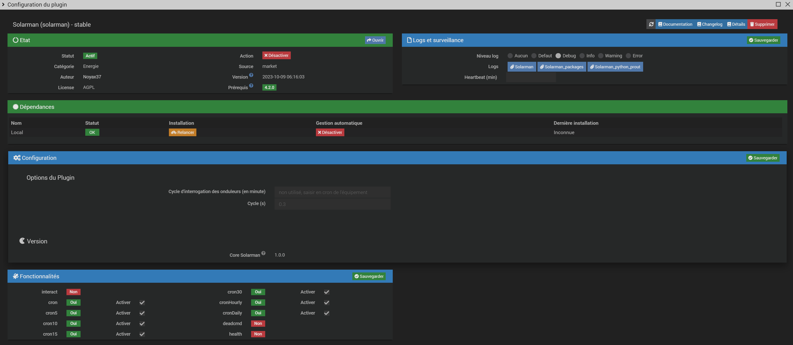

   

Présentation
===
Le plugin Solarman permet de récupérer les informations de votre onduleur monitoré par le site https://home.solarmanpv.com/ , comme par exemple les Sofar Solar HYD de 3 à 6K ES. 

Fichiers de configuration auto pour: Afore_BNTxxxKTL-2mppt, deye_2mppt, deye_4mppt, deye_hybrid, deye_sg04lp3, deye_string, hyd-zss-hp-3k-6k, kstar_hybrid, sofar_g3hyd, sofar_hyd3k-6k-es, sofar_lsw3, sofar_wifikit, solis_1p8k-5g, solis_3p-4g, solis_hybrid, solis_s6-gr1p, zcs_azzurro-ktl-v3.

       

Pré-requis:
===
Pour pouvoir récupérer les infos de votre onduleur il faut un onduleur compatible (liste ci dessus) équipé d'une clé wifi. Cela ressemble à ça:

 
 

Installation du plugin
===
Besoin d'explications? Ok, alors une fois le plugin installé faites une mise à jour des dépendances

 
 

Configuration générale du plugin
===

Rien de particulier. Un champ non accessible pour une éventuelle évolution mais pas certain qu'elle voit le jour.

 
 
 
 
 

Création d'un nouvel équipement
===

Cliquer sur le + "Ajouter"

## Choix
 

Donnez un nom à votre nouvel équipement puis choisissez le fichier modèle qui servira à le paramétrer

 

## Paramétrage de l'équipement:
 

 
Les premiers champs sont classiques.

Ensuite le fichier de configuration que vous avez sélectionné ne sera plus modifiable. Si vous vous êtes trompé alors supprimer cet équipement et recréez en un autre.

Il faut que vous saisissiez l'adresse ip de votre clé wifi, le port qu'elle utilise pour communiquer et son numéro de série. Le port est en général 8899 mais il faudra que vous alliez chercher le numéro de série dans les configuration de votre clé.

la page de configuration se visualise avec votre navigateur internet en saisissant l'adresse de votre clé: http://adresse_ip_de_votre_clé_wifi l'utilisateur et le mot de passe par défaut si vous ne les avez pas changés sont admin et admin

Ensuite choississez la fréquence d'interrogation que vous souhaitez, seuls 1, 5, 10, 15 et 30 minutes sont valides.

Remerciements
===

Merci à @jmccrohan pour avoir développé l'excellente librairie pySolarmanV5 [https://pysolarmanv5](https://pysolarmanv5.readthedocs.io/en/stable/#)

Merci à [@StephaneJoubert](https://github.com/StephanJoubert/home_assistant_solarman) qui a développé un module pour Home Assistant sur lequel j'ai récupéré queleques infos et fichiers python très bien écrits

Merci enfin à [@Lydie13](https://community.jeedom.com/u/lydie13) qui a traduit les fichiers de configuration dans notre langue

Bug
===

En cas de bug sur le plugin il est possible de demander de l'aide :

[https://community.jeedom.com/tag/plugin-solarman](https://community.jeedom.com/tag/plugin-solarman)
